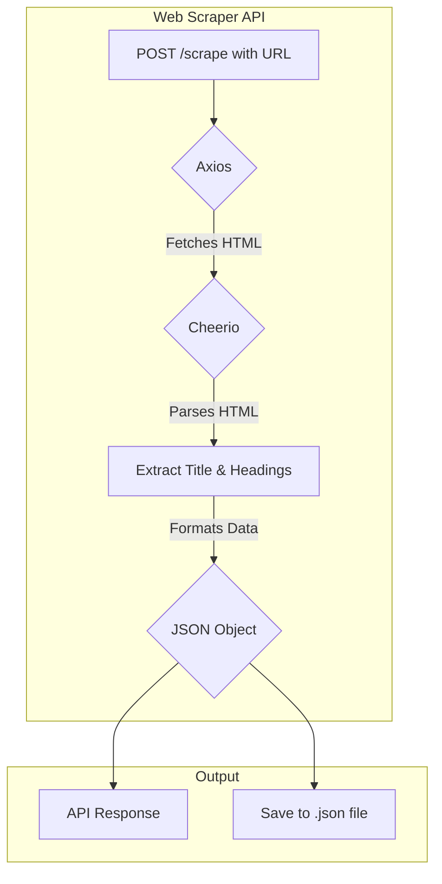

# 🕷️ Web Scraper

> A powerful and flexible web scraping tool built with Node.js, NestJS, Axios, and Cheerio to extract and store website data efficiently.

---

## 📌 Features
- 🔍 Extract page **title** and headings (**H1**, **H2**, **H3**)
- ⏳ Add **timestamp** for each scrape
- 📂 Save results as JSON files in `scraped-data/`
- ⚡ Lightweight & fast
- 🛠 Robust error handling for invalid URLs and network errors
- ✅ Returns JSON response from API and persists same object to disk

---

## 💡 How it works (visual)

## 🛠 Tech Stack
- Node.js (v14+)
- NestJS (framework)
- TypeScript
- Axios (HTTP client)
- Cheerio (server-side HTML parsing)
- Prettier / ESLint (optional)
